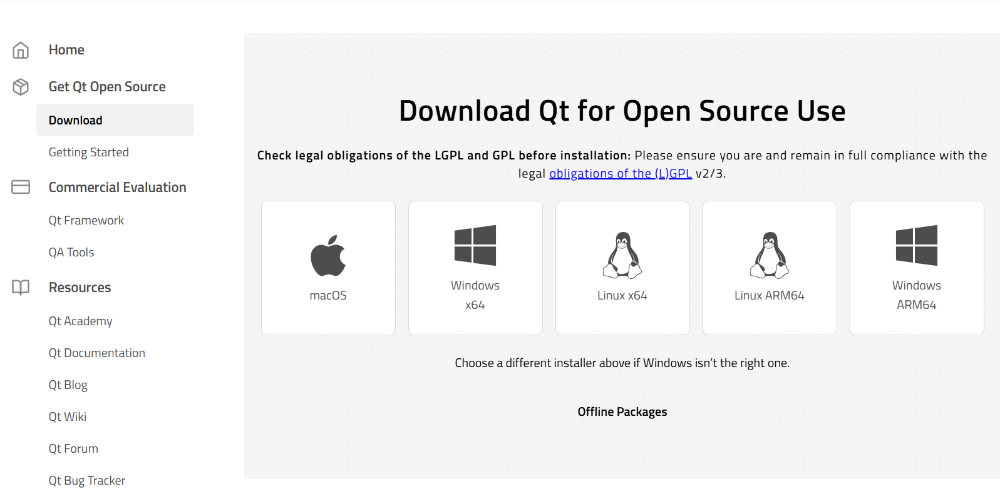
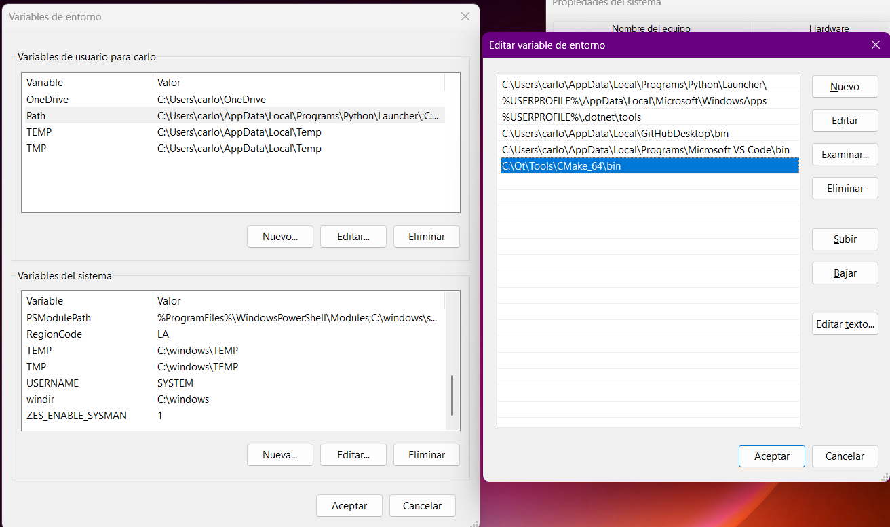

# Aplicaciones
> INSTALACIÓN DE APLICACIONES


---
## Descripción General

Instructivo que sirve como guía en la instalación de ciertas aplicaciones

## Tabla de Contenido

- [Instalación C++](#instalación-c)
- [Instalación Qt](#instalación-qt)
- [Características Principales](#características-principales)
- [Estructura de la Práctica](#estructura-de-la-práctica)
- [Interfaz del Sistema](#interfaz-del-sistema)
- [Tipos de Reportes](#tipos-de-reportes)
- [Ejecución del Programa](#ejecución-del-programa)
- [Agregar al PATH](#agregar-al-path)
---

## Instalación C++


## Instalación Qt
1. Ingresar a la siguiente página, e iniciar sesión. En caso no cuente con un usuario, registrarse ya que, para la instalación, el programa le pedirá que inicie sesión para continuar con la instalación. 
[Login Qt](https://login.qt.io/login)

2. Una vez Logeado, en el panel izquierdo aparecerá la opción de descarga, al darle click mostrará la siguiente imagen y solo basta con seleccionar el SO y continuar con la descarga.



3. Ejecutar como administrador el programa, se le solicitará ingresar las credenciales anteriormente creadas y de manera intuitiva, instar todo por defecto.
4. Continuar con la instalación hasta finalizarla. 
5. Agregar en el PATH en las variables de entorno las direcciones de CMake y del compilador MinGW (Direcciones donde se encuentra la instalación)
```bash
C:\Qt\Tools\CMake_64\bin        -> CMake
C:\Qt\Tools\mingw1310_64\bin    -> MinGW
```
6. Correr los siguientes comandos en la terminal para saber si se instaló correctamente.
```bash
cmake --version
```

## Características Principales


## Estructura de la Práctica


## Interfaz del Sistema


## Tipos de Reportes:

## Ejecución del Programa

## Agregar al PATH
1. Presiona **Win + S**
2. Escribe: variables de entorno
3. Abre: `Editar las variables de Entorno del Sistema`
4. Entra a Variables de entorno
5. En esta opción, se mostrarán dos tipos de variables, la primera "Variables de usuario para #nombre" son para un usuario en específico del Sistema, y el otro se aplicará para todos los usuarios creados en el Computador. Desplegar la barra de navegación hasta encontrar donde diga **Path**, seleccionarlo,
6. Dale a Editar
7. Agrega una nueva ruta, por ejemplo se agregará Qt 

La dirección de instalación de Qt sería: `C:\Qt\Tools\CMake_64\bin`



8. Una vez agregados, dar en la opción de Aceptar en todas las ventanas emergentes y se recomendará Reiniciar el computador para efectuar cualquier cambio pendiente.


